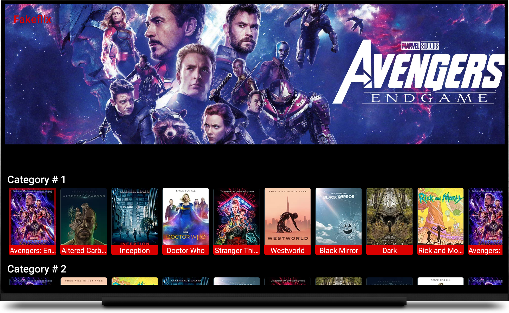

# FlixView

[  ](https://bintray.com/xuhaibahmad/maven/FlixView/_latestVersion)
[](https://jitpack.io/#xuhaibahmad/flixview)



## Table of Contents

- [About](#about)
- [Usage](#usage)
- [Contributing](#contributing)
- [License](#license)

## About

FlixView is a custom Android view to create Netflix-style catalogs for Android TV.

## Usage

1. Add JCenter repository in the `build.gradle` file in the root of your project:

```
repositories {
    google()
    jcenter()
}
```

2. Next, add the FlixView dependency in the `build.gradle` file of your app module:

```
implementation 'com.zuhaibahmad.flixview:flixview:<current-version>'
```

3. Add `FlixView` to your layout:

```
<com.zuhaibahmad.flixview.FlixView
    android:id="@+id/vFlixView"
    android:layout_width="match_parent"
    android:layout_height="match_parent"
    app:banner_aspect_ratio="36:10"
    app:selection_foreground="@drawable/selection_foreground"
    app:content_width="@dimen/test_card_width"
    app:content_height="@dimen/test_card_height"
    app:content_title_background_color="@color/redPrimary"
    app:content_title_text_color="@color/textColorPrimary"
    app:content_title_text_size="@dimen/title_text_size"
    app:category_title_text_color="@color/textColorPrimary" />
```

## Contributing

PRs and Issues are always welcomed.

## License

FlixView is [Apache-2.0](http://www.apache.org/licenses/LICENSE-2.0.txt) licensed.
